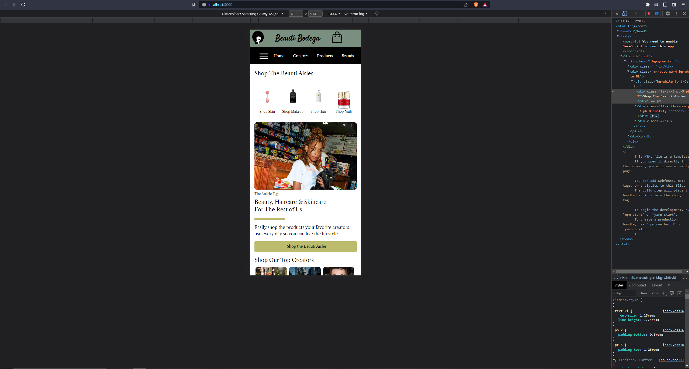
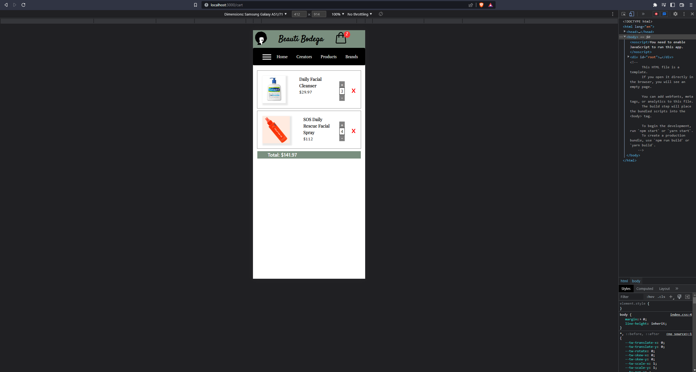
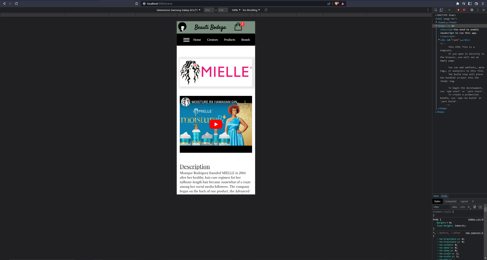
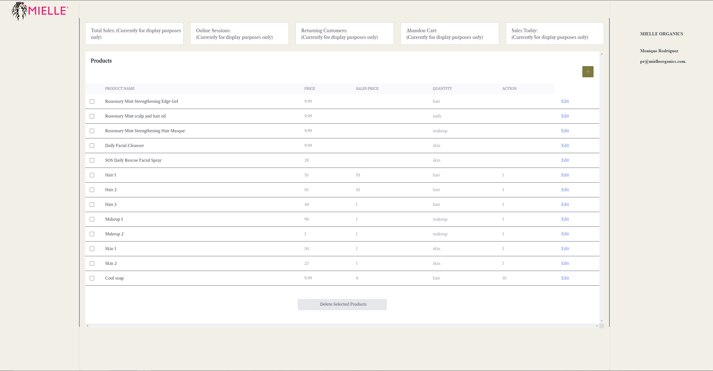

# Beauti Bodega

## About the Project

Beauti Bodega is a mobile first shopping application targeted towards companies who sell beauty products, as well as their customers. The application in its current state features a login page, register page, landing page, a products page that allows the user to view all the products available on the site, a cart page that allows the user to view all the products they've added to their cart, a brands page that allows the user to navigate through all the brands featured on the site, profile pages that allow the user to view/edit your profile and visit other users' profiles, and pages specific to managers of an individual brand. On the products page, the user can click on a specific product which will navigate them to a sub-page that displays more detailed information about the product they clicked on; they will also be able to add that product to their cart at a desired quantity. Likewise, once the user selects a brand on the brands page they will be navigated to a sub-page where they can view more detailed information about that brand, as well as all the products that brand has added to the site.

Currently, there are 2 primary user roles on Beauti Bodega: brand admin, and shopper. Every person who registers an account on Beauti Bodega is a shopper by default. Shoppers have access to viewing some authorization blocked sub-pages, have the ability to add/remove products from their cart, and have the ability to make changes to their profile. A user with a shopper account can also register a brand to Beauti-Bodega which will require them to submit information and a logo for that brand. This action will automatically change the user's account from a shopper to a brand admin for the new brand they've created.

A brand admin will have the same access and abilities as a shopper, but will also have access to the brand manager pages for their specific brand. On the brand manager pages, the user can add, edit, and delete products for their brand. When products are added, updated, or deleted the changes will be made visible on the products page, and on the specific brand page

In a completed version of Beauty Bodega, there would be a 3rd primary role called 'creator'. A user who is a creator would be able to make posts that feature an image, description, and links to the beauty products that they are sponsoring or using in their post. All other users on the site would be able to follow the creator profiles, and get access to a feed of their posts. Currently, the scaffolding for user editing such as changing profile pictures and tags has been completed, as well as the ability to change a shopper account to a creator account (which will make the account visible to anyone who visits the site), but for all intents and purposes it is a work in progress.

The ability for any shopper to switch their account status from a shopper to a brand admin or creator would be replaced with an application that would require a review to see if the applicant meets the requirements to be featured as a company or an influencer on Beauti Bodega.
## Tech Stack

*TypeScript
*Node.js
*React
*CSS
*TailWind
*Express.js
*PostgreSQL
*ElephantSQL
*Firebase
*Sequelize
*Redux Toolkit

## Minimum Viable Product

* A standard user would have the ability to create an account, view all of the products avalible on the site, and veiw all of the brands avalibe on the site. 
* A brand manager would be able to add, edit and remove products for their brand. 
## Stretch Goals To Be Completed

* Changes to the landing page to make it more dynamic
* Ability for users to follow other users
* Ability for creators to make posts that feature products
* Ability for standard users to see a feed of Creator posts
* Ability for standard users to leave comments on Creator posts
* Ability for any user to leave reviews on Brands and Products

## Screenshots of the webpage:

## Dev Team

[Austin Desana:](https://github.com/adesana)

[Kipp Hulick:](https://github.com/kippHulick)

[Ryan Kovlaske:](https://github.com/Rkovl)

[Thomas Zimmerman:](https://github.com/clintwestwords)

